# 🚀 Computation Search - Motor de Busca Inteligente

Este projeto é um motor de busca avançado que combina a robustez e velocidade do **Elasticsearch 8.x** com a inteligência cognitiva de **LLMs locais (Ollama - Llama 3.1)** e processamento de imagem via **OCR especializado (LatexOCR)** para indexar, identificar, corrigir e priorizar fórmulas matemáticas e conteúdos de computação científica.

---

## 🏗️ Arquitetura do Sistema

O fluxo de busca do sistema é orquestrado de forma assíncrona pelo Spring Boot para manter tempos de resposta baixos, minimizando gargalos de rede e processamento de LLM:

```mermaid
sequenceDiagram
    autonumber
    actor User as Usuário / Cliente
    participant FE as React Frontend
    participant BE as Spring Boot Backend
    participant LLM as Ollama (Llama 3.1)
    participant ES as Elasticsearch 8.x
    participant OCR as Python LatexOCR

    %% Fluxo de Busca por Texto
    Note over User, FE: 🔍 Fluxo de Busca por Texto
    User->>FE: Insere consulta (Debounced / Submit)
    FE->>BE: GET /search?query={query}&page={page}
    rect rgb(15, 23, 42)
        Note right of BE: Spring Boot Orchestrator
        BE->>BE: Valida se é fórmula (isLikelyFormula)
        alt É fórmula matemática
            BE->>LLM: Identifica Nome da Fórmula (Assíncrono com Timeout)
            LLM-->>BE: Retorna nome identificado (ex: "Schrödinger")
        else Não é fórmula
            Note right of BE: Ignora LLM para otimizar latência
        end
        BE->>ES: Executa busca com Boosts, Fuzziness, Collapse e Suggester
        ES-->>BE: Retorna Hits, Highlights, Collapsed URLs & Sugestão Spellcheck
    end
    BE-->>FE: Retorna SearchResponse (Resultados + didYouMean)
    FE-->>User: Renderiza Resultados formatados com KaTeX

    %% Fluxo de Busca por Imagem
    Note over User, FE: 📷 Fluxo de Busca por Imagem (OCR)
    User->>FE: Envia Imagem contendo fórmula
    FE->>BE: POST /search/image (Multipart)
    BE->>OCR: POST /extract-latex (FastAPI)
    OCR-->>BE: Retorna string de fórmula LaTeX extraída
    BE->>BE: Executa pipeline de Busca por Texto (passos 4 em diante)
    BE-->>FE: Retorna Resultados da imagem processada
```



---

## 🎯 Engenharia de Relevância & Mecanismo de Busca (Elasticsearch)

Para fornecer resultados precisos e dar prioridade a documentos altamente relacionados ao contexto científico pesquisado, o motor utiliza uma consulta booleana combinada (`bool query`) com pesos dinâmicos ajustados (`boosting`):

### 1. Pesos Dinâmicos de Relevância (Boosting) & Busca Difusa
A relevância (`_score`) de cada documento é calculada com base na significância do termo no campo correspondente. O Elasticsearch calcula a **Distância de Levenshtein** (número mínimo de edições necessárias para converter uma string em outra). A configuração `"AUTO"` define dinamicamente os limites baseados no tamanho da palavra (0-2 letras: exata; 3-5 letras: 1 edição; >5 letras: 2 edições).

Abaixo está o trecho principal do cliente Elasticsearch (`EsClient.java`) que orquestra os pesos e a busca difusa:

```java
// Localizado em: src/main/java/com/computational/search/domain/EsClient.java
public SearchResponse search(String query, String identifiedName, Integer page) {
    int pageSize = 10;
    int from = ((page != null ? page : 1) - 1) * pageSize;

    boolean isQuoted = query.startsWith("\"") && query.endsWith("\"");
    String processedQuery = isQuoted ? query.substring(1, query.length() - 1) : query;

    Query esQuery = Query.of(q -> q
            .bool(b -> {
                // 1. Busca aproximada tolerante a falhas (Fuzzy Match / Levenshtein)
                b.should(s -> s
                    .multiMatch(mm -> mm
                        .fields("formulas_latex", "content", "title")
                        .query(processedQuery)
                        .boost(1.0f)
                        .fuzziness("AUTO")
                    )
                );

                // 2. Correspondência exata de frase no título (High Boost)
                b.should(s -> s
                    .matchPhrase(mp -> mp
                        .field("title")
                        .query(processedQuery)
                        .boost(100.0f)
                        .slop(2) // Permite flexibilidade de até 2 palavras fora de ordem
                    )
                );

                // 3. Boosting cognitivo de fórmulas identificadas pelo LLM (Max Boost)
                if (identifiedName != null && !identifiedName.trim().isEmpty()) {
                    b.should(s -> s
                        .match(ma -> ma
                            .field("title")
                            .query(identifiedName)
                            .operator(Operator.And)
                            .boost(150.0f)
                        )
                    );
                }

                if (isQuoted) {
                    b.minimumShouldMatch("100%"); // Transforma os 'should' opcionais em 'must'
                }

                return b;
            })
    );

    return elasticsearchClient.search(s -> s
            .index("wikipedia")
            .from(from)
            .size(pageSize)
            .query(esQuery)
            .collapse(c -> c.field("url.keyword")) // Elimina resultados duplicados do mesmo link
            .suggest(su -> su // Solicitação ortográfica para o "Você quis dizer"
                .text(processedQuery)
                .suggesters("spellcheck", sg -> sg
                    .term(t -> t.field("content"))
                )
            ),
            ObjectNode.class);
}
```

---

## 🔍 Tolerância a Erros & Sistema de Sugestões

A inteligência de busca inclui suporte nativo a erros de digitação e auto-completar inteligente:

### 1. Auto-Complete (Sugestões de Escrita ao Digitar)
No momento em que o usuário digita no input, um evento *debounced* de **150ms** no frontend dispara uma requisição para a rota `/v1/suggest`. O backend utiliza a query `matchPhrasePrefix` no campo `title` para varrer os títulos do banco de dados em tempo real:
```java
Query esQuery = Query.of(q -> q
    .matchPhrasePrefix(mpp -> mpp
        .field("title")
        .query(query)
    )
);
```

### 2. Sugestão Spellcheck ("Você quis dizer")
Caso a consulta original possua um erro ortográfico, o Elasticsearch ativa o analisador de termos (`term suggester`) no campo `content`. O backend processa a melhor sugestão léxica concorrente e monta de volta a frase com o método a seguir:

```java
// Localizado em: src/main/java/com/computational/search/service/SearchService.java
private String extractDidYouMean(co.elastic.clients.elasticsearch.core.SearchResponse<ObjectNode> response, String originalQuery) {
    try {
        var suggestMap = response.suggest();
        if (suggestMap == null || !suggestMap.containsKey("spellcheck")) return null;

        var suggestions = suggestMap.get("spellcheck");
        boolean hasCorrection = false;
        StringBuilder correctedQuery = new StringBuilder();

        for (var suggestion : suggestions) {
            if (suggestion.isTerm()) {
                var termSuggestion = suggestion.term();
                String text = termSuggestion.text();
                var options = termSuggestion.options();
                if (options != null && !options.isEmpty()) {
                    String bestOption = options.get(0).text();
                    if (!bestOption.equalsIgnoreCase(text)) {
                        correctedQuery.append(bestOption).append(" ");
                        hasCorrection = true;
                        continue;
                    }
                }
                correctedQuery.append(text).append(" ");
            }
        }
        return hasCorrection ? correctedQuery.toString().trim() : null;
    } catch (Exception e) {
        return null;
    }
}
```

---

## 🚀 Otimizações de Performance e Formatação de Dados

### 1. Formatação Segura de LaTeX no Frontend (Balanceamento de Símbolos)
A renderização de expressões matemáticas no navegador é crítica. O backend executa um sanitizador avançado antes de enviar o resumo para o React, garantindo que delimitadores de cifrão `$` e chaves `{}` abertos de forma incompleta no texto enciclopédico sejam fechados antes da renderização via KaTeX:

```java
// Localizado em: src/main/java/com/computational/search/service/SearchService.java
private String safeLatexFormat(String content, boolean truncate) {
    if (content == null) return "";
    
    // Substitui tags XML antigas por delimitadores padrão do KaTeX
    String formatted = content.replaceAll("<(math|som)\\d*>", "\\$")
                              .replaceAll("</(math|som)\\d*>", "\\$")
                              .replaceAll("\\s+", " ").trim();
    
    if (truncate && formatted.length() > 300) {
        formatted = formatted.substring(0, 297).trim() + "...";
    }
    
    // Corrige delimitadores ímpares de KaTeX ($) e chaves desbalanceadas
    long dollarCount = formatted.chars().filter(ch -> ch == '$').count();
    if (dollarCount % 2 != 0) {
        int lastDollar = formatted.lastIndexOf('$');
        String formulaPart = formatted.substring(lastDollar + 1);
        
        long openBraces = formulaPart.chars().filter(ch -> ch == '{').count();
        long closeBraces = formulaPart.chars().filter(ch -> ch == '}').count();
        
        // Garante o fechamento de chaves abertas antes do cifrão final
        for (int i = 0; i < (openBraces - closeBraces); i++) {
            formatted += "}";
        }
        formatted += "$";
    }
    return formatted;
}
```

---

## 🛠️ Configuração do Ambiente Local

### Pré-requisitos
*   **Java 21** e **Maven**
*   **Node.js 18+** & **npm**
*   **Python 3.12+** (para o microsserviço de OCR)
*   **Elasticsearch 8.x** rodando na máquina ou via docker.
*   **Ollama** executando os modelos locais `llama3.1:8b` (para classificação) e `llava` (para multimodalidade).

### 1. Executando o Backend (Java Spring Boot)
Configure as credenciais e host do Elasticsearch no arquivo `.env` localizado na raiz do projeto e inicie a aplicação:
```bash
mvn spring-boot:run
```

### 2. Executando o Serviço de OCR (Python FastAPI)
Navegue até a pasta de scripts, instale as dependências e inicie o servidor:
```bash
cd pythonScript
source venv/bin/activate
pip install -r requirements.txt
python ocr_service.py
```
O serviço FastAPI de extração de LaTeX por OCR rodará na porta **8001**.

### 3. Executando o Frontend (React + Vite)
Instale os pacotes e inicialize o servidor de desenvolvimento:
```bash
cd front-end/ComputationSearch
npm install
npm run dev
```
Acesse a aplicação pela porta padrão: `http://localhost:5173`.
